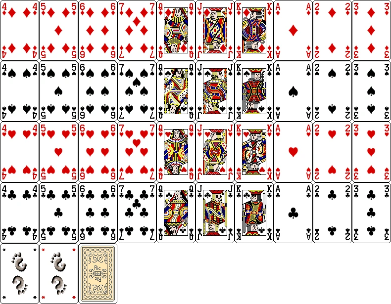

# Fodinha

## Deck

A standard fodinha deck would not contain non of the eights, nines, or tens. The ranking of cards is, from lowest to highest: four, five, six, seven, queen, jack, king, ace, two, and three. 

## Games rules

1. Each player is given a said amount of lives to play (usually 5). The goal of the game is to be the last-standing player. 
2. No lives can be gained through the course of the game only lost. 
3. The game is played in a series of sets. Each set is composed of one or more rounds. 
4. Before each set each player must predict how many of the rounds said person will win based on their cards. Lives are lost by how much you are off from your initial prediction. 
5. The amount of rounds in a set is defined by how many cards each player is dealt. A player must play a card in each round. (Ex: if players are dealt three cards each there will be three rounds in that set)
6. In the first set players will play one round (dealt one card). The number of rounds (cards dealt) in a set will keep on growing by one until either a player is eliminated or there aren't sufficient cards. In that case, the count will be reset to one. 
7. A round is won by playing the highest card. If two players play a card with the same rank value their cards will cancel out (unless its a "manilha") and neither would be able to win said round. 
8. At the start of each set a card is dealt faced up to the table. That card's rank will define which card will be valued the most at the start of a round these cards are referenced as "manilhas". Different from the other cards the suit of the card matters. The ranking of suits goes, from highest to lowest: clubs (♣), hearts (♥), spades (♠), and diamonds (♦). (Ex: a 6 of hearts is the flipped card. the order for that set would be, from highest to lowest: 6 of clubs, 6 of spades, 6 of diamonds, three, two, etc...)
10. In the chance that no player wins a round the following round of the set (if there is one) will be worth whatever the prior round was worth plus one. So if the prior round was worth one and there wasn't a winner then the next round is worth two. If a player were to win that next round it would count as two makes.
